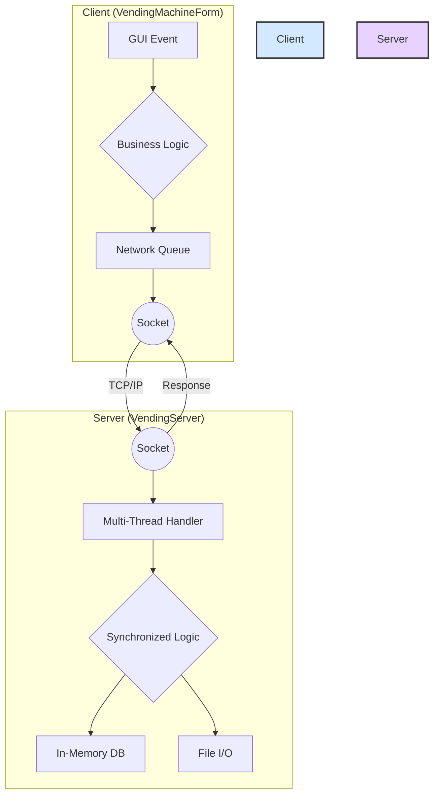

# ☕ Java Distributed Vending Machine System (자판기 통합 관리 시스템)

## 📌 프로젝트 개요
본 프로젝트는 다수의 클라이언트(자판기)가 단일 중앙 서버와 통신하며 데이터를 동기화하는 **다중 접속(Multi-Client) 자판기 시뮬레이션 시스템**입니다. 
순수 Java와 Socket API를 활용하여 TCP/IP 기반의 실시간 통신 환경을 구축하였으며, Java Swing을 통한 GUI 프레젠테이션 계층과 비즈니스 로직 계층을 철저히 분리하여 설계했습니다. 특히 다양한 핵심 자료구조(Linked List, Stack, BST, Queue)와 알고리즘을 시스템 곳곳에 배치하여 인메모리(In-memory) 성능 최적화와 메모리 관리의 효율성을 실증한 아키텍처입니다.

## 🛠️ 기술 스택 및 환경
* **Language:** Java
* **GUI Framework:** Java Swing, AWT
* **Network:** TCP/IP Socket (`java.net`)
* **Persistence:** File I/O (`java.io`)

## ✨ 최근 개선 사항
- **리플렉션 코드 제거:** `DrinkNode`의 정보 업데이트 시 Java Reflection API를 사용하던 부분을 `setter` 메서드 호출로 변경하여 코드의 안정성과 가독성을 향상시켰습니다.
- **불필요한 import 정리:** `VendingServer.java` 및 `VendingMachineForm.java` 파일에서 중복되거나 사용되지 않는 import 구문을 제거하여 코드를 깔끔하게 정리했습니다.

## 🏛️ 시스템 아키텍처


## ⭐ 핵심 기능 및 아키텍처

### 1. 실시간 다중 접속 및 동시성 제어 (Concurrency Control)
* 중앙 관리 서버는 다중 스레드(Multi-thread)를 통해 N개의 자판기 노드와 동시에 연결됩니다.
* 여러 클라이언트에서 동시다발적으로 결제 및 환불 트랜잭션이 발생할 때, `synchronized` 모니터 락(Lock)을 활용하여 공유 데이터(서버 총매출 등)에 대한 **Thread-Safe**한 환경을 보장합니다.

### 2. 핵심 자료구조의 실무적 응용 (Data Structures)
* **단일 연결 리스트 (Singly Linked-List):** 각 자판기의 음료 재고(초기 10개)를 동적인 연결 리스트로 관리하여 데이터 확장에 유연하게 대응합니다.
* **스택 (Stack):** LIFO(Last-In-First-Out) 특성을 활용하여 사용자의 '최근 구매 취소(Undo)' 기능을 구현, $O(1)$의 시간 복잡도로 즉각적인 트랜잭션 롤백을 수행합니다.
* **이진 탐색 트리 (Binary Search Tree, BST):** 관리자 모드에서 특정 가격대의 상품을 검색할 때, 배열의 선형 탐색($O(n)$) 대신 메모리 내에 BST를 동적으로 빌드하여 $O(\log n)$의 속도로 탐색 성능을 최적화했습니다.
* **원형 큐 (Circular Queue):** 클라이언트가 서버로 전송할 네트워크 패킷을 담아두는 버퍼 역할로 사용되어, 비동기 네트워크 통신 시 프론트엔드 UI가 멈추는 프리징(Freezing) 현상을 방지합니다.

### 3. 알고리즘 및 메모리 관리 (Algorithms & Memory)
* **탐욕 알고리즘 (Greedy Algorithm):** 거스름돈 반환 시 기기 내부에 보유한 동전 재고(500원, 100원, 50원, 10원) 현황을 파악하고, 가장 큰 단위부터 최적의 개수를 산출하여 차감합니다.
* **동적 할당 시뮬레이션:** 사용자가 투입한 화폐는 고정 배열이 아닌 `ArrayList`로 동적 관리되며, 결제나 반환 트랜잭션 종료 시 즉각적인 자원 해제(`clear()`)를 통해 가비지 컬렉터(GC)의 메모리 회수를 유도합니다.
* **버블 정렬 (Bubble Sort):** 영속화된 로컬 데이터베이스(`sales.txt`) 파일 스트림을 읽어와, 관리자 모드에서 매출 통계를 정렬하여 시각화합니다.

### 4. 보안 및 예외 처리 (Security & Exception Handling)
* 관리자 모드 진입 시 정규표현식(Regex)을 적용하여 숫자와 특수문자가 포함된 8자리 이상의 비밀번호 복잡도를 강제합니다.
* 화폐 투입 한도 제한(지폐 5,000원 이하, 총액 7,000원 이하) 및 기기 내 거스름돈 부족 시 예외 처리 로직을 완벽하게 구현했습니다.

## 🚀 시작하기 (설치 및 실행 방법)

프로그램 실행 전, 컴파일러의 인코딩을 UTF-8로 지정하여 한글 깨짐 현상을 방지해야 합니다.

**1. 전체 소스 코드 컴파일**
```bash
# 프로젝트 루트 디렉토리에서 실행
javac -encoding UTF-8 JavaVendingClient/*.java JavaVendingServer/*.java
```

**2. 서버 실행 (통합 관제 시스템)**
```bash
# 프로젝트 루트 디렉토리에서 실행
java -cp . JavaVendingServer.VendingServer [포트번호]
# 예: java -cp . JavaVendingServer.VendingServer 8080
```

**3. 클라이언트 실행 (개별 자판기)**
```bash
# 프로젝트 루트 디렉토리에서 실행
java -cp . JavaVendingClient.VendingMachineForm [서버_IP] [포트번호]
# 예: java -cp . JavaVendingClient.VendingMachineForm 127.0.0.1 8080
```
